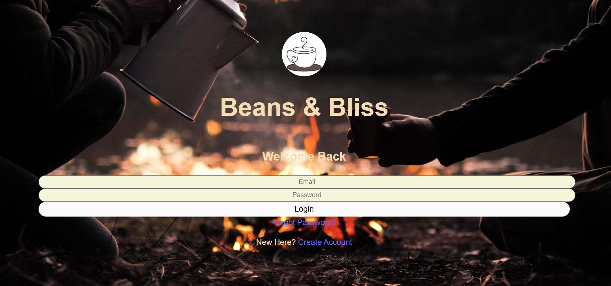
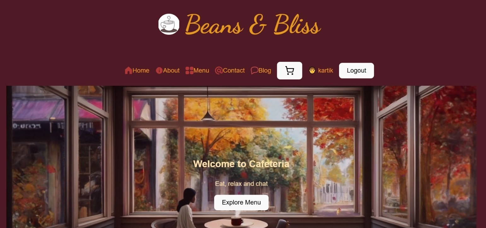
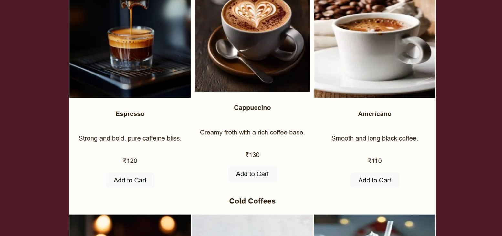

# Bless-Bliss-Cafe-Management-project
A full-stack cafe ordering and management system built using the MERN stack, featuring user authentication, dynamic menu display, cart functionality, and order processing.
# ☕ Cafe Management System (MERN Stack)

A modern and responsive cafe web application built using the **MERN stack**, providing features such as user authentication, menu browsing, cart management, and order placement.

---

## 🚀 Features

- 🔐 User Registration & Login (JWT Authentication)  
- 🔁 Forgot Password (Email Reset Link) *(optional)*  
- 🍽️ Dynamic Menu Display (with images & prices)  
- 🛒 Add to Cart & Cart Summary  
- 📦 Order Processing & Storage in MongoDB  
- 👨‍🍳 Admin (optional) – Add/Edit/Delete menu items  
- 📱 Fully Responsive UI  

---

## 🛠️ Tech Stack

### **Frontend**
- React.js  
- React Router  
- Axios  
- Context API (Cart State)  

### **Backend**
- Node.js  
- Express.js  
- MongoDB & Mongoose  
- Bcrypt, JWT  

---

## 📂 Project Structure
cafe-project/
├── backend/
│ ├── models/
│ ├── routes/
│ ├── controllers/
│ └── server.js
├── cafe-frontend/
│ ├── src/
│ ├── components/
│ ├── pages/
│ └── App.js
└── README.md

## 📸 Screenshots
### **1. Login Page**


### **2. Home Page**


### **2. Menu Page**


### **3. Cart Page**


### **4. Order Summary**


## 🔧 Installation & Setup

### **1. Clone the Repository**
```bash
git clone https://github.com/YOUR_USERNAME/cafe-project.git
cd cafe-project
